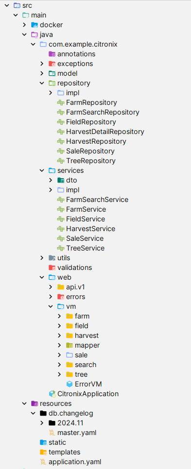

🌱 Citronix - Lemon Farm Management System
Citronix is a farm management application designed to help farmers efficiently manage their lemon farms, including farm creation, field allocation, tree productivity tracking, harvest management, and sales. The system ensures proper validation and optimization of resources, focusing on increasing productivity and streamlining operations.

##Project Structure

📋 Features
Farm Management

Create, update, and view farm details (name, location, area, creation date).
Multi-criteria search using the Criteria Builder.
Field Management

Allocate fields to farms with defined areas.
Validate field areas:
Minimum: 0.1 hectares.
Maximum: 50% of the total farm area.
Limit farms to a maximum of 10 fields.
Tree Management

Track tree planting dates, ages, and associated fields.
Calculate tree productivity based on age:
Young trees (< 3 years): 2.5 kg/season.
Mature trees (3-10 years): 12 kg/season.
Old trees (> 10 years): 20 kg/season.
Non-productive trees (> 20 years): 0 kg.
Harvest Management

Track harvests by season (Winter, Spring, Summer, Autumn).
Limit to one harvest per season.
Record harvest date and total quantity harvested.
Sales Management

Record sales with details (date, unit price, client, associated harvest).
Automatically calculate revenue: Revenue = quantity × unit price.
⚙️ Technologies Used
Backend: Spring Boot (Java 17) Database: PostgreSQL ORM: Hibernate Validation: Spring Validation Testing: JUnit, Mockito Build Tool: Maven Object Mapping: MapStruct

🚀 Getting Started
Prerequisites
Java 17
Maven
PostgreSQL
Running the Application
Clone the repository : https://github.com/NabilChabab/Citronix.git

Conception : 
-> https://drive.google.com/file/d/1P6lEGf_QQByShSDhLfXkojfEQLzgfuzu/view?usp=sharing

Jira Board && PPT Presentation :
Jira -> https://chababnabil.atlassian.net/jira/software/projects/CIT/boards/36?atlOrigin=eyJpIjoiYTAxYTY5YzVkNzEyNGQ2OGIxNzE5MjA1YzlhN2Q2ZjgiLCJwIjoiaiJ9
PPT Canva -> https://www.canva.com/design/DAGVuv1Ayjo/Yb04_HXka03-VDUURlLmzQ/edit?utm_content=DAGVuv1Ayjo&utm_campaign=designshare&utm_medium=link2&utm_source=sharebutton
